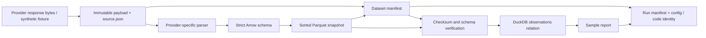

# Phase 2B: data storage, provenance and manifests

## Scope and configuration

This is an opt-in analytical layer. Existing backtest inputs, strategy
interfaces, accounting, risk logic, and legacy CSV archive paths are unchanged.
No historical archive is migrated, renamed, overwritten, or downloaded.

Runtime dependencies now explicitly include PyArrow 24.0.0 (already installed
and locked in Phase 2A through Streamlit) and DuckDB 1.5.3 (new). All other
package versions are unchanged. The existing uv 0.11.8, CPython 3.12.10,
2026-06-04 resolution cutoff and locked installation workflow remain in force.

Data root precedence:

1. Explicit `DataStore(root)` / demo `--data-root` argument.
2. `QUANTBOT_DATA_ROOT` environment variable.
3. `Path.home() / "QuantData" / "quant_trading_bot"`.

The root must be absolute, outside a Git checkout and outside OneDrive.
Symlinks/junctions are resolved before checking. Merely constructing a store
does not create directories. No personal absolute path exists in reusable
source. Recommended Windows configuration for this project:

```powershell
$env:QUANTBOT_DATA_ROOT = 'C:\QuantData\quant_trading_bot'
$env:UV_PROJECT_ENVIRONMENT = 'C:\QuantEnvs\quant_trading_bot_phase2'
uv sync --locked --all-extras --group dev --python 3.12.10
```

The external root cannot be tracked by the project Git repository. In addition,
`/data/`, `/local_data/`, `/runs/`, `*.parquet`, `*.duckdb` and
`*.duckdb.wal` remain ignored if generated artifacts are accidentally placed
in the checkout. Source under `src/quantbot/data` remains trackable.

## Layout and semantics

```text
<data-root>/
  raw/<provider>/<dataset>/<retrieval-date>/<source-id>/
    payload.bin
    source.json
  imports/normalized/<provider>/<dataset>/<retrieval-date>/<source-id>/
    payload.bin
    source.json
  normalized/options/<provider>/options-v1/<dataset>/<dataset-version>/
    part-00000.parquet
    manifest.json
  normalized/equities/<provider>/equities-v1/<dataset>/<dataset-version>/
    part-00000.parquet
    manifest.json
  reference/contracts/                    # reserved; no guessed contract master
  reference/corporate_actions/            # reserved; no fabricated adjustments
  features/<feature-version>/<dataset-version>/  # reserved; never called raw
  runs/<run-id>/
    manifest.json
    sample.json                           # demonstration output
```

Versioned bounded snapshots are used instead of a per-contract/day file tree.
Small samples produce one file; default shards contain up to 1,000,000 rows,
with 128,000-row groups and Zstandard level 3 compression. Smaller final shards
are normal; user-selected targets below 100,000 rows are rejected. This avoids
creating one tiny file per option contract. Files are canonically sorted, use
explicit Arrow types and have no pandas index metadata.

This phase accepts a batch in memory. It is not a streaming bulk-ingestion or
large-archive compaction system. Symbols and coverage are indexed in the JSON
manifest; Parquet column statistics support future selective reads. Date/symbol
directory partitions and a persistent catalog can be added only when measured
archive workloads justify them.

- `provider_payload`: exact UTF-8 provider response bytes, stored before
  flattening/normalization. No credentials or authorization headers are stored.
- `fixture_payload`: explicitly synthetic provider-shaped input, distinguished
  in its source manifest. It is not represented as historical market evidence.
- `legacy_normalized`: existing transformed input such as legacy CSV/gzip;
  stored under `imports/normalized`, never called a true provider response.
- `normalized_observations`: versioned typed observations with explicit source
  references, schema, transformations, dates, and quality statistics.
- Derived features belong in the reserved versioned `features` area, with
  upstream dataset references. No feature engine is introduced here.
- Contract/corporate-action reference areas are reserved independently of
  observations. No contract multipliers or lifecycle facts are invented.

Immutability is enforced by the storage API: complete directories are published
from a temporary sibling, existing snapshot bytes must match, and run IDs are
write-once. Checksums detect later external edits. This is not OS-enforced WORM
storage, cryptographic signing, or a distributed multi-writer database.

## Components

- `data/storage/schemas.py`: strict provider-independent Arrow schemas,
  contract IDs, value validation, deterministic ordering.
- `data/storage/provenance.py`: portable JSON, SHA-256, source/request guards,
  Git and lockfile identities.
- `data/storage/store.py`: external roots, immutable source capture, batched
  Parquet, dataset readback, isolated DuckDB queries, run manifests.
- `data/options_providers/theta_analytical.py`: separate v3 JSON parsing and
  `ingest_payload`; no HTTP call, old cache access or spot fallback.
- Existing `ThetaDataLoader(source_store=store)`: optional exact-response
  capture. Its `source_manifests` list provides source records to later
  analytical ingestion. Default legacy loading behavior remains opt-in to
  neither the new storage nor network access.
- `scripts/phase2b_storage_demo.py`: entirely deterministic offline sample
  inputs plus a real execution-time run record.



DuckDB uses an in-memory connection over the verified Arrow readback of Parquet.
One SELECT statement is allowed. Filesystem/network SQL access is disabled.
This intentionally validates the complete small dataset before queries; it does
not yet implement a lazy catalog for multi-terabyte archives.

## Options schema: options-v1

All optional values use Arrow null. NaN source measurements become null in the
provider parser; non-finite values cannot enter normalized tables. Integer
counts are validated rather than truncated. Unknown normalized columns fail
explicitly; unknown provider columns remain recoverable from exact source bytes.

| Fields | Type / meaning |
|---|---|
| underlying | Required uppercase identity; never inferred from a caller's different symbol |
| contract_id | Required deterministic composite ID; explicitly not fabricated OCC symbology |
| provider_contract_id | Optional provider contract symbol retained separately |
| expiration | Required date32 |
| strike | Required positive decimal128(20,6); no v2/v3 magnitude heuristic |
| right | Required call or put; no invalid-right fallback to call |
| multiplier | Nullable positive int64; missing is unknown, never assumed 100 |
| exercise_style, settlement_type | Nullable supplied contract facts |
| observation_date | Required date32 identifying the observation session |
| event_timestamp | Nullable quote/event timestamp, UTC nanoseconds |
| provider_created_at | Nullable provider creation timestamp, separately retained |
| retrieved_at | Required timezone-aware receipt timestamp, UTC nanoseconds |
| trade_timestamp, underlying_timestamp | Separate supplied times, UTC nanoseconds |
| bid, ask | Nullable float64; no midpoint substitution |
| bid_size, ask_size | Nullable nonnegative int64 |
| last, trade_price, trade_size, trade_count | Supplied trade fields; last is not executable price |
| open, high, low, close | Optional provider option OHLC; close is not silently relabeled last |
| volume, open_interest | Nullable nonnegative int64; unavailable OI is not zero |
| implied_volatility | Supplied fractional IV; suspect finite values retained and flagged |
| delta, gamma, theta, vega, rho | Nullable float64; provider units retained |
| underlying_price | Nullable supplied spot; no hidden cache or adjusted-price fallback |
| iv_error | Optional provider solver diagnostic retained |
| bid_exchange, ask_exchange, bid_condition, ask_condition, provider_status | Optional provider status fields |
| quality_flags | Required list of strings; includes missing/crossed/negative quote, missing OI and unknown multiplier flags |

Composite identity includes underlying, expiration, right, exact strike,
multiplier and supplied contract/exercise/settlement identifiers. Duplicate
observation keys fail. A missing multiplier or contract detail does not establish
that a contract is standard or safe to backtest.

Crossed and negative quotes can be retained as flagged research observations;
storage is not an execution validator. The Phase 1 fill engine remains
responsible for refusing economically invalid execution inputs.

The Theta parser requires an explicit observation date, an explicit caller EOD
date, or an event timestamp interpreted in a caller-declared source timezone.
It never derives a quote session from `last_trade` or `created`. If a v3
response lacks a reliable date/event, a caller must supply a verified single-day
observation date. An undated multi-day response cannot safely be ingested by
guessing. Naive timestamps require `source_timezone`; DST ambiguity fails.
An explicit date disagreeing with the event's local date fails.

Unknown provider fields, including higher-order Greeks, remain in the source
payload even if not in v1. An unsupported response shape or conflicting nested
contract identity fails. The archive is not silently coerced to fit.

## Daily equity schema: equities-v1

Required: symbol, observation_date, retrieved_at, quality_flags.
Optional event/provider-created timestamps remain separate.

Raw/unadjusted OHLC are named `raw_open/high/low/close`.
Adjusted research OHLC are named `adjusted_open/high/low/close`.
At least one explicitly named close basis is required.
`volume` is nullable int64. Dividends and split_ratio are optional supplied
values, not synthesized corporate actions.

Adjusted fields require `adjustment_convention`:
`provider_adjusted` if only supplied adjusted values are known, or
`adjusted_over_raw` when a factor is supplied. A supplied positive
`adjustment_factor` must reconcile every available pair within numerical
tolerance. Missing adjusted OHLC remain null rather than being manufactured
from raw OHLC. Ambiguous fields such as an unlabeled `close` are rejected.

The new schema does not modify the Phase 1 ETF adjusted research convention
or implement a raw-share corporate-action ledger.

## Source, dataset and run manifests

All JSON has `manifest_version=1` and canonical serialization. A manifest's
embedded `manifest_sha256` hashes its other fields. References hash the exact
complete referenced file. Relative paths are rooted at the external store;
the data root can be relocated as a complete tree.

Source manifest:

- semantic kind, provider and dataset;
- exact payload checksum, size and filename;
- timezone-aware retrieval timestamp;
- allowlisted request fields such as endpoint path, symbol(s), expiration,
  requested dates, max_dte, format and explicit timezone policy.

Dataset manifest:

- kind, provider, dataset, schema_version and normalization_version;
- normalization_parameters, including timezone and date policy for Theta;
- dataset_version derived from its full content/provenance record;
- symbols, requested_range, observed_range and per-symbol observed coverage;
- source retrieval timestamps and exact source-manifest checksum references;
- row/file counts and per-file paths, byte counts, row counts and SHA-256;
- per-column null counts and quality-flag counts;
- schema fingerprint and exact writer/compression/sharding settings;
- Git commit, dirty status, tracked diff checksum and lockfile checksum.

A row's retrieval timestamp must match a referenced source receipt.
Observed rows must fall inside the requested range. Coverage is observed dates,
not a claim of complete exchange-calendar coverage or complete chains.
Empty normalizations are not published as successful datasets; no-data source
receipts can still be preserved.

Run manifest:

- run ID and UTC timestamp;
- strategy identity, exact JSON configuration and config checksum;
- Git/lock identity and caller code_version;
- dataset version and manifest checksum references;
- output/report paths relative to the external root.

Git can be unavailable in an installed distribution: the record explicitly
reports this, rather than inventing a revision. A dirty checkout is flagged;
the tracked diff checksum is evidence, not a saved patch or an archive of
untracked source. Use a clean committed checkout for independently reproducible
research runs. Checksums do not establish provider truth or authenticity.

Request metadata is allowlisted. Credential-shaped keys, common secret/token
forms, URL authentication/query credentials and personal filesystem paths are
rejected rather than redacted silently. No authorization headers are persisted.
Do not submit credentials in arbitrary free-text metadata; this is not a
general-purpose secret classification service.

## Legacy cache corrections

Committed legacy writers/readers and their deterministic disk tests were
inspected. The old formats are per-date canonical CSV.gz files under
`raw/<provider>/<underlying>/<year>/<month>`, enriched files with a
`.greeks.csv.gz` suffix, and monthly normalized CSV.gz under `processed`.

Those files have already lost some provider fields and timestamps. Their
directory name does not make them original provider responses. Existing
historical archives were not opened or rewritten in bulk.

`list_raw_dates` used `Path.stem`, which turns `2022-01-03.csv.gz` into
`2022-01-03.csv`; parsing failed and valid dates disappeared. It now recognizes
both exact supported suffixes, ignores malformed names and returns unique
sorted dates. Regression: two valid cache dates previously returned an empty
list, now return January 3 and January 4.

All three legacy Theta normalizers now preserve unavailable OI as nullable
Int64 instead of filling it with zero. Supplied zero remains zero.
Existing stored zeros cannot be retrospectively distinguished from fabricated
missing values without original inputs; no mass correction is attempted.
Other legacy normalization shortcuts are not automatically migrated into the
new data layer or changed in historical backtests.

## Offline demonstration and verification

```powershell
$env:QUANTBOT_DATA_ROOT = 'C:\QuantData\quant_trading_bot'
& 'C:\QuantEnvs\quant_trading_bot_phase2\Scripts\python.exe' scripts/phase2b_storage_demo.py --run-id phase2b-sample
& 'C:\QuantEnvs\quant_trading_bot_phase2\Scripts\python.exe' -m pytest tests/test_phase2b_storage.py
uv lock --check
uv pip check --python 'C:\QuantEnvs\quant_trading_bot_phase2\Scripts\python.exe'
```

Use a new run ID for another execution. Dataset snapshots reuse identical
content/provenance; run records are never overwritten.

Expected deterministic sample results:

| Underlying | Bid | Ask | OI | Multiplier |
|---|---:|---:|---:|---:|
| QQQ | 3.0 | 3.2 | 0 | null |
| SPY | 2.0 | 2.2 | null | null |

Both contracts have expiration 2026-01-16, strike 500 and right call, but have
distinct composite IDs. SPY's observation date is January 5 while its last
trade is January 2. Observation, event, creation and receipt fields survive.

One equity row retains raw close 102, adjusted close 51 and factor 0.5;
adjusted open remains null. The sample has two dataset manifests, two small
Parquet files, two exact synthetic source payloads and one run manifest.
The requested options range ends January 6; observed coverage honestly ends
January 5. All output stays in the external root.

Tests cover identity/types, null OI, time separation, date conflicts,
raw/normalized distinctions, input and manifest checksums, source tampering,
schema validation, row/file/coverage statistics, deterministic sorting and
Parquet bytes, DuckDB SQL, query restrictions, source-capture hooks, external
roots, Git exclusions, immutable snapshots and runs, failed ingestion,
retrieval provenance and equity adjustment semantics.

Byte determinism is verified with the locked PyArrow version and writer
settings, not promised across arbitrary future library versions. No paid data
subscription, calendar completeness guarantee, options assignment model,
historical contract master, bulk migration, or new strategy is included.

Implementation references: [PyArrow Parquet documentation](https://arrow.apache.org/docs/python/parquet.html)
and [DuckDB Python API](https://duckdb.org/docs/stable/clients/python/overview).


## Verified test record

On Windows AMD64, CPython 3.12.10, uv 0.11.8:

- Initial new tests: 31 failed before implementation, including the existing
  date-discovery and three OI defects. One initial test-collection typo used a
  reserved pytest argument name; it was corrected before the baseline run.
- New and directly affected data/provider tests: 86 passed in 4.56 seconds
  (42 new Phase 2B tests, 44 existing tests).
- Unchanged Phase 1A/1B/1C regressions: 178 passed in 6.19 seconds.
- Full clean-clone-capable suite: 1,427 passed, 14 skipped in 116.15 seconds.
- Full-suite failures: 0; collection errors: 0; pytest warnings: 0.
- Skips: 5 AI, 4 energy and 5 semiconductor optional SEC-cache checks.
- uv lock check: passed; uv pip check: all 72 distributions compatible;
  locked sync dry run: no changes.
- Git diff for Phase 1 accounting/options/risk/cost modules and the three
  economic regression files: empty.

The sample verification exercised both schemas and the complete source ->
normalization -> Parquet -> manifest -> DuckDB/readback path. A subsequent
clean-commit sample records the exact committed revision in its run manifest.

The second Phase 2 verification environment was synced strictly from the same lock; all 42 new tests passed there in 4.90 seconds.
